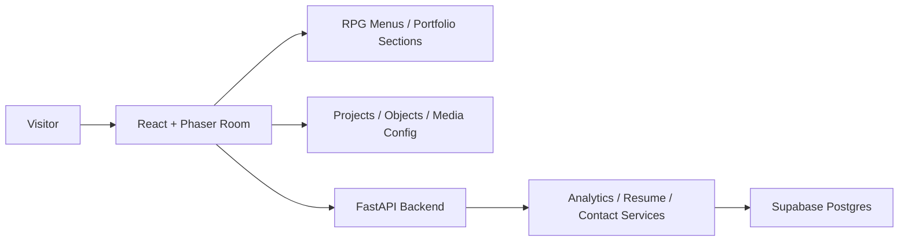

# Ayaan's Room

Ayaan's Room is a playable 2D RPG portfolio for Ayaan Khan. Visitors move a small pixel character around a cozy, surreal room and interact with objects to open portfolio memories: about, skills, projects, media, simulations, resume, experience, and contact.

The visual direction is a clean white-room retro RPG portfolio using local replacement assets from `frontend/public/assets`. It is inspired by dreamy room exploration and emotional RPG menus, without copying copyrighted game assets, fonts, music, maps, characters, or UI.

## Quick Commands

Run the whole project with one command:

```powershell
make dev
```

`make dev` will create missing `.env` files from examples, install dependencies, create the backend virtual environment, and start:

- Frontend: `http://127.0.0.1:5173`
- Backend: `http://127.0.0.1:8000`

Other commands:

```powershell
make help            # show available commands
make setup           # create missing .env files and install dependencies
make test            # run frontend and backend tests
make build           # build frontend and run backend tests
make frontend-dev    # run only the frontend
make backend-dev     # run only the backend
make clean           # remove generated build/test output
```

If `make` is not installed:

```powershell
powershell -NoProfile -ExecutionPolicy Bypass -File scripts/dev.ps1
```

## Concept

The website opens into one playable white room. The player uses WASD, arrow keys, or mobile touch controls to walk around. The room outline is visual only: walking beyond the edge wraps the player to the opposite side, creating an endless dream-space feel. Standing near an object shows an in-world RPG dialog prompt. Pressing `E`, pressing `Space`, clicking, or tapping an object opens an RPG-style modal.

Room objects:

- Laptop: About Me
- Book: Skills
- Ticket: Featured Projects
- Door: All Projects
- Remote: Simulation Console
- Piano/headphones-style media marker: Media Gallery
- Watch: Experience Timeline
- Tag: Resume Download
- Phone: Contact

## Architecture



Frontend state and portfolio content are data-driven. The playable room is implemented in Phaser 3, while RPG menus are React components.

## Tech Stack

- Frontend: React, Vite, TypeScript, Tailwind CSS, Phaser 3, Framer Motion
- Backend: Python, FastAPI, Pydantic, Supabase client
- Database: Supabase Postgres
- Hosting: Vercel frontend, Render backend, Supabase database
- Tests: Vitest and pytest

## Windows Local Setup

Recommended:

```powershell
make dev
```

Manual frontend:

```powershell
cd frontend
copy .env.example .env
npm install
npm run dev
```

Manual backend:

```powershell
cd backend
copy .env.example .env
python -m venv .venv
.\.venv\Scripts\Activate.ps1
pip install -r requirements.txt
uvicorn app.main:app --reload
```

Blank local environment values are allowed for development. Missing backend, analytics, media, iframe, or audio features degrade gracefully.

## Environment Variables

Frontend:

| Variable | Purpose |
| --- | --- |
| `VITE_API_BASE_URL` | Backend API URL. Leave empty for frontend-only mode. |
| `VITE_SITE_NAME` | Site display name. |
| `VITE_ENABLE_AUDIO` | Enables audio controls when `true`. |

Backend:

| Variable | Purpose |
| --- | --- |
| `APP_ENV` | `local`, `staging`, or `production`. |
| `API_HOST` | API host binding. |
| `API_PORT` | API port. |
| `CORS_ORIGINS` | Comma-separated allowed frontend origins. |
| `SUPABASE_URL` | Supabase project URL. |
| `SUPABASE_SERVICE_ROLE_KEY` | Server-side Supabase service key. |
| `DATABASE_URL` | Optional Postgres connection string. |
| `RESUME_FILE_URL` | External resume PDF URL. |
| `CONTACT_EMAIL_TO` | Optional contact recipient for future email sending. |

## Supabase Setup

Run [docs/supabase_schema.sql](docs/supabase_schema.sql) in the Supabase SQL Editor. The backend uses service-role credentials server-side. If Supabase is unavailable, analytics and contact persistence fail gracefully.

## Adding Projects

Edit [frontend/src/data/projects.ts](frontend/src/data/projects.ts). Each project supports:

- `id`
- `title`
- `short_description`
- `long_description`
- `technologies`
- `role`
- `screenshots`
- `demo_video_url`
- `slide_url`
- `github_url`
- `live_demo_url`
- `tags`
- `featured`
- `status`

## Adding Interactable Objects

Edit [frontend/src/game/assets/objectConfig.ts](frontend/src/game/assets/objectConfig.ts). Each object has:

- `object_id`
- `display_name`
- `position`
- `size`
- `interaction_radius`
- `interaction_type`
- `linked_portfolio_section`
- `color`
- `accent`
- `label`

The Phaser scene reads this config and creates clickable/tappable zones automatically.

Interaction feedback is intentionally diegetic. Objects do not show selection rectangles; nearby objects gently float/scale and show a small HUD-dialog prompt using the local `HUD_battleUI` dialog-box crop.

Object visual scale is controlled in [frontend/src/game/assets/spriteConfig.ts](frontend/src/game/assets/spriteConfig.ts), while object placement and interaction radius are controlled in `objectConfig.ts`. Keep the configured object `width`/`height` close to the rendered `displayWidth`/`displayHeight` so proximity checks match what visitors see.

## Asset Guide

Put assets under:

```text
frontend/public/assets/
  sprites/
  backgrounds/
  rooms/
  audio/
    bgm/
    sound_effects/
  fonts/
```

The project preserves the current folder structure. You do not need to manually move flat audio or image folders for the app to run.

Generate or refresh the asset index with:

```powershell
cd frontend
npm run assets:manifest
```

The script scans `frontend/public/assets`, lists images and audio, infers categories from filenames/folders, reads PNG dimensions, and writes:

```text
frontend/src/game/assets/generatedAssetManifest.ts
```

The frontend build also runs this manifest script automatically.

### Asset Config Files

All game assets are referenced through centralized configs:

```text
frontend/src/game/assets/
  assetManifest.ts
  generatedAssetManifest.ts
  spriteConfig.ts
  playerConfig.ts
  audioConfig.ts
  objectConfig.ts
  roomConfig.ts
  AudioManager.ts
```

Do not reference random files directly from React components or Phaser scenes. Add them to these configs instead.

### Font Rule

The handwritten replacement font is used only for the main `Ayaan's Room` title. Side menus, buttons, prompts, modals, project copy, forms, and settings use readable system fonts so the portfolio stays professional.

### Asset Selection Logic

Prefer monochrome or black-and-white sketch/pixel crops for portfolio objects. Mixed sheets are not sliced as equal grids unless they are clearly grid-aligned. Instead, `spriteConfig.ts` defines manual `x/y/width/height` crop rectangles around complete visible objects.

`items_charms.png` is white line art on a black background. The scene converts those crops into runtime canvas textures where white line art becomes black pixels and the black sheet background becomes transparent. This avoids black rectangular cutouts. Use colorful assets only when no readable monochrome replacement exists.

Current object crops live in `spriteConfig.ts`, and object-to-section mappings live in `objectConfig.ts`.

### How Inference Works

Images are classified by folder/name/dimensions:

- filenames containing `character`, `player`, or `hero`: sprite sheet
- filenames containing `tile`: tileset
- filenames containing `object`, `misc`, or `prop`: object sheet
- large images or filenames containing `room`, `screen`, or `background`: background

Frame-size inference tries common pixel-art sizes:

- `64x64`
- `48x48`
- `32x32`
- `24x24`
- `16x16`

When metadata is uncertain, the app uses conservative fallbacks and continues running.

### Manual Crop And Scale Override

Use [frontend/src/game/assets/spriteConfig.ts](frontend/src/game/assets/spriteConfig.ts) to override inferred metadata. For mixed object sheets, prefer named crop rectangles and explicit display size:

```ts
{
  key: "obj_example_book",
  sourceKey: "sprites_items_charms",
  x: 22,
  y: 448,
  width: 64,
  height: 72,
}

bookSprite: {
  id: "bookSprite",
  sourceKey: "sprites_items_charms",
  frameKey: "obj_example_book",
  displayWidth: 34,
  displayHeight: 38,
  blendMode: "difference",
  notes: "White-on-black crop converted to black-on-transparent at runtime.",
}
```

If an object crop looks fragmented, tighten the crop to the connected object bounds or swap to a clean fallback placeholder. Do not display partial sheet fragments.

### Player Direction Mapping

Player behavior is centralized in [frontend/src/game/assets/playerConfig.ts](frontend/src/game/assets/playerConfig.ts), which currently re-exports the `playerSprite` config from `spriteConfig.ts`.

The current player uses tight manual crops from the downloaded `character_omori.png` replacement sheet. The sheet is mixed, so player frames are registered by named rectangles rather than equal grid slicing. The configured animation keys describe the expected directions:

- `walkUp` / `idleUp`: back-facing
- `walkDown` / `idleDown`: front-facing
- `walkLeft` / `idleLeft`: left-facing
- `walkRight` / `idleRight`: right-facing

Idle preserves the last faced direction. If you replace the player with a cleaner sheet later, update the named frame rectangles in `spriteConfig.ts` while keeping the player source pointed at an actual downloaded asset.

### Adding New Audio

Drop files anywhere under `frontend/public/assets/audio`. The manifest script infers:

- `bgm`, `music`, `song`, `piano`, `space`: music
- `ambience`, `ambient`, `forest`, `hum`, `static`: ambience
- `select`, `cursor`, `click`, `quest`, `item`: UI
- `spiral`, `up`, `down`: transitions
- movement files are indexed but not played by the room

[frontend/src/game/assets/AudioManager.ts](frontend/src/game/assets/AudioManager.ts) supports preload, one-shot SFX, looping music, stop, mute/unmute, master volume, music volume, SFX volume, localStorage preferences, and graceful playback failure.

### Broken Asset Troubleshooting

- Run `npm run assets:manifest` after adding files.
- Check `generatedAssetManifest.ts` for inferred dimensions and categories.
- If a sprite sheet is sliced incorrectly, add a manual override in `spriteConfig.ts`.
- If an object shows the wrong frame, adjust the named crop in `spriteConfig.ts` or swap its `assetKey` in `objectConfig.ts`.
- If an audio file does not play, verify browser support for the file format and check the console warning.
- If an asset fails to load, the game logs a warning and uses placeholders where possible.

### Replacing Placeholder Art

The room has minimal fallback placeholders only for missing assets. Replace pieces incrementally:

- player: update `playerConfig.ts` / `spriteConfig.ts`
- room background: update `roomConfig.ts`
- interactable object sprites: update `objectConfig.ts`
- audio mappings: update `audioConfig.ts`

## Adding Rooms Or Maps

The current MVP uses one room controlled by [frontend/src/game/assets/roomConfig.ts](frontend/src/game/assets/roomConfig.ts) and rendered by [frontend/src/game/RoomScene.ts](frontend/src/game/RoomScene.ts). To add rooms:

1. Create another object config file such as `secondRoomObjects.ts`.
2. Add another Phaser scene or extend `RoomScene` to accept a room layout config.
3. Add a doorway object whose interaction switches the active room.
4. Keep collision and interactable data in config rather than hardcoding it into React.

## Adding Media

Edit [frontend/src/data/media.ts](frontend/src/data/media.ts). Media entries can represent videos, images, PDFs, diagrams, slides, and external demo links. Missing URLs show fallback copy instead of breaking the modal.

## Adding Simulations

Edit [frontend/src/data/simulations.ts](frontend/src/data/simulations.ts). Simulations support:

- `title`
- `description`
- `iframe_url`
- `fallback_url`
- `thumbnail`
- `technologies`

If an iframe is blocked or not configured, the external fallback link remains available.

## Analytics

Tracked events:

- site visits
- object interactions
- project views
- resume downloads
- simulation launches
- contact submissions

Frontend analytics are best-effort through [frontend/src/services/analytics.ts](frontend/src/services/analytics.ts). Failed analytics calls are ignored. Backend persistence is isolated in repository classes and logs failures without crashing user-facing routes.

## Movement And Audio

Wraparound is configured in [frontend/src/game/assets/roomConfig.ts](frontend/src/game/assets/roomConfig.ts). `bounds` controls only the decorative room outline. `wrapBounds` controls actual player wrapping and is currently the full Phaser canvas:

```ts
wrapBounds: { x: 0, y: 0, width: 800, height: 450 }
```

The player wraps only after crossing the visible canvas edge plus `wrapPadding`; the inner rectangle never blocks movement.

Audio starts muted. The visitor must explicitly enable sound. Volume and mute preferences are stored in `localStorage`. Background music loops through the audio manager, and UI/interaction sounds are one-shots. Walking/footstep sounds are intentionally disabled.

Do not add copyrighted music. Optional legal asset drop-in paths are documented in [frontend/public/assets/README.md](frontend/public/assets/README.md).

The sound buttons switch between configured local BGM files from `frontend/public/assets/audio/bgm`. Playback failures are ignored so the room remains usable.

## Copyright-Safe Asset Policy

This repository does not include Omori sprites, characters, music, fonts, UI, maps, or other copyrighted game material. Local assets are treated as user-provided replacement assets and are referenced through centralized config files.

If you own or license replacement assets, place them under:

```text
frontend/public/assets/sprites/
frontend/public/assets/audio/
frontend/public/assets/rooms/
```

Then wire them in [frontend/src/game/assets/spriteConfig.ts](frontend/src/game/assets/spriteConfig.ts), [frontend/src/game/assets/objectConfig.ts](frontend/src/game/assets/objectConfig.ts), and [frontend/src/game/assets/audioConfig.ts](frontend/src/game/assets/audioConfig.ts).

## Deployment

### Vercel

1. Root directory: `frontend`
2. Build command: `npm run build`
3. Output directory: `dist`
4. Set `VITE_API_BASE_URL` to the Render backend URL.

### Render

1. Root directory: `backend`
2. Build command: `pip install -r requirements.txt`
3. Start command: `uvicorn app.main:app --host 0.0.0.0 --port $PORT`
4. Add Supabase, CORS, and resume environment variables.

## Troubleshooting

- `make` not found: run `powershell -NoProfile -ExecutionPolicy Bypass -File scripts/dev.ps1`.
- Frontend runs but backend calls fail: verify `VITE_API_BASE_URL` or continue in frontend-only mode.
- Resume returns 503: set `RESUME_FILE_URL`.
- Contact says backend unavailable: start FastAPI and check `CORS_ORIGINS`.
- Supabase data missing: run the schema and verify service-role credentials.
- Audio does not play: click the sound control; browsers block autoplay by design.

## Future Improvements

- Add a second room and doorway transitions.
- Add original pixel sprite sheets and walk cycles.
- Add a quest log overlay with richer achievement states.
- Add background music from original or properly licensed sources.
- Add Playwright visual regression checks for desktop and mobile.
